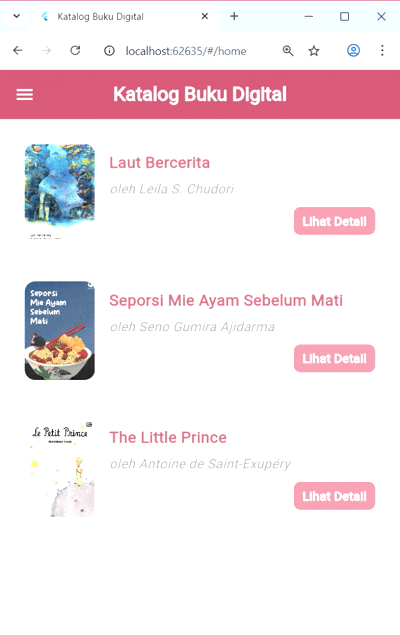

# Aplikasi Katalog Buku Digital – Flutter + GetX



Aplikasi ini dibuat menggunakan **Flutter** dengan **GetX** sebagai state management dan navigasi.  
Tema desain yang digunakan bernuansa **pink pastel elegan**, menampilkan daftar buku, detail, genre, serta halaman tentang dan kontak perpustakaan.

---

## Deskripsi Singkat

Aplikasi ini menampilkan katalog buku digital yang dapat dilihat berdasarkan daftar, detail buku, dan genre.  
Tiap halaman memiliki AppBar, tata letak elegan, serta navigasi yang mudah menggunakan `Get.toNamed()`.

---

## Fitur Utama

- **Daftar Buku (Home Page)**
  - Menampilkan daftar buku menggunakan `ListView.builder`.
  - Setiap buku memiliki judul, penulis, genre, gambar, dan deskripsi.
  - Klik salah satu buku untuk menuju ke halaman **Detail Buku**.

- **Detail Buku**
  - Menampilkan informasi lengkap dari buku yang dipilih (judul, penulis, genre, deskripsi, dan gambar).
  - Menggunakan `Get.arguments` untuk menerima data dari halaman Home.

- **Genre Buku**
  - Menampilkan daftar genre dalam bentuk `GridView.builder`.
  - Tiap genre memiliki ikon dan warna gradasi pink pastel yang berbeda.
  - Desain dibuat compact, dengan animasi halus dan efek tap lembut.

- **Tentang Perpustakaan**
  - Halaman berisi deskripsi singkat tentang konsep dan tujuan perpustakaan digital.
  - Didesain dengan layout sederhana namun elegan menggunakan warna tema lembut.

- **Kontak**
  - Menampilkan informasi kontak seperti email, media sosial, dan alamat.
  - Dilengkapi ikon interaktif agar tampil lebih menarik.

- **Navigasi Menggunakan GetX**
  - Rute antar halaman diatur di `app/routes/app_pages.dart`.
  - Navigasi dilakukan dengan:
    ```dart
    Get.toNamed(Routes.DETAIL, arguments: book);
    ```

- **Widget Custom**
  - Terdapat widget `BookCard` terpisah di folder `widgets/` yang menampilkan tiap buku di halaman Home.
  - Widget ini digunakan agar kode lebih rapi dan reusable.

---

## Penjelasan Fungsi Utama

### `main.dart`
- Titik awal aplikasi.
- Inisialisasi GetX (`GetMaterialApp`) dan mendefinisikan halaman awal (Home).
- Menerapkan tema warna pink pastel sebagai tema global aplikasi.

### `HomeController`
- Mengelola data buku menggunakan `RxList` dari GetX.
- Menyimpan daftar buku berupa map yang berisi:
  - `title`, `author`, `genre`, `image`, dan `description`.

### `HomeView`
- Menggunakan `Obx()` untuk memantau perubahan data `books`.
- Menampilkan daftar buku menggunakan `ListView.builder`.
- Setiap item menggunakan `BookCard` untuk tampilan konsisten.

### `BookCard` (Widget Custom)
- Menerima parameter: `title`, `author`, `imageUrl`, dan `onTap`.
- Menampilkan informasi singkat tentang buku dalam desain card modern.
- Dipanggil berulang di dalam `ListView.builder`.

### `GenreView`
- Menggunakan `GridView.builder` untuk menampilkan daftar genre buku.
- Card genre menggunakan gradasi warna pastel dan ikon.
- Desain dibuat minimalis, compact, dan responsif.

### `AboutView`
- Berisi teks deskriptif tentang aplikasi dan misi perpustakaan digital.
- Didesain dengan padding rapi, font lembut, dan warna tema elegan.

### `ContactView`
- Menampilkan informasi kontak (email, Instagram, alamat).
- Menggunakan ikon dan teks berwarna lembut agar serasi dengan tema aplikasi.

---


## Cara Menjalankan

1. Pastikan Flutter sudah terinstal dan environment sudah diset.
2. Jalankan perintah berikut di terminal:

   ```bash
   flutter clean
   flutter pub get
   flutter run
